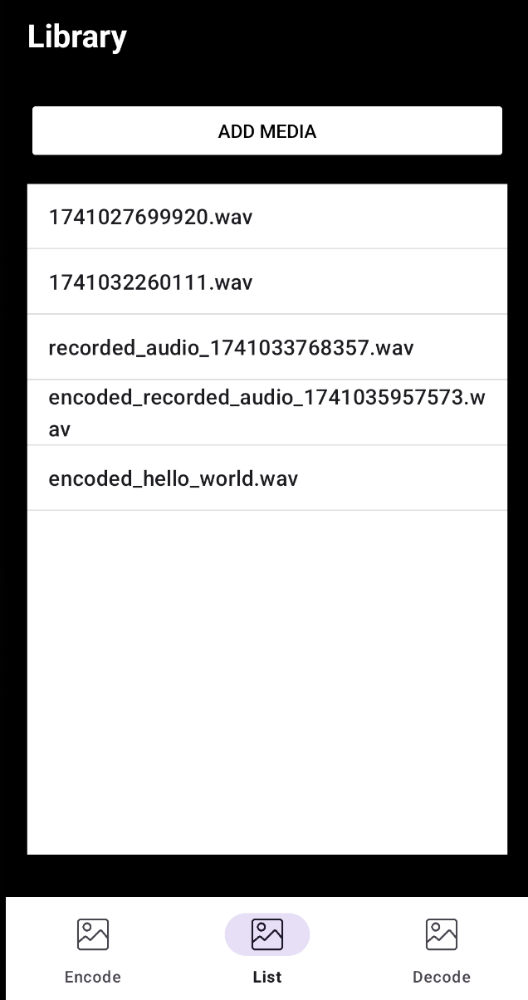
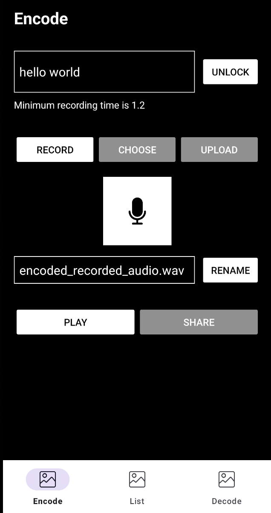
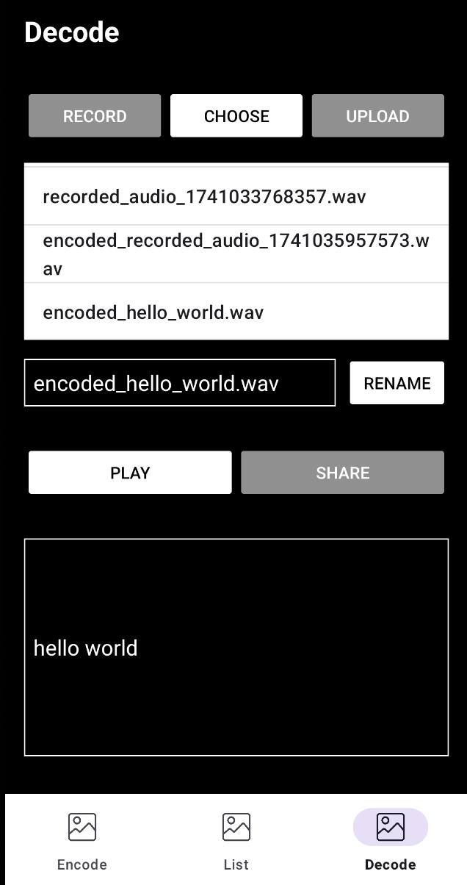
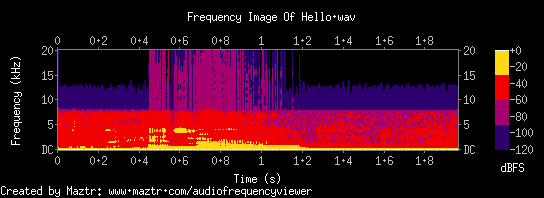
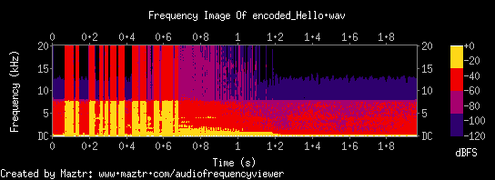
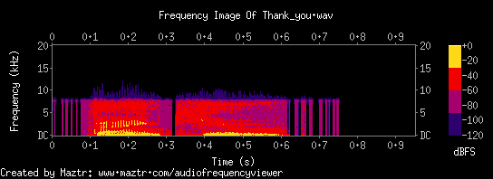
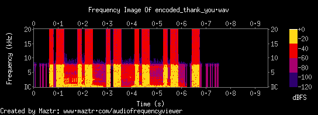

# AudioStego: Secure Audio Data Embedding

**AudioStego** is a robust Android application that provides secure audio steganography capabilities. It allows users to embed textual data within 16-bit PCM WAV audio files, ensuring covert communication and data protection. Leveraging modern Android concurrency practices and advanced signal processing techniques, AudioStego delivers a professional-grade solution for secure data hiding.

## Features

### 1. High-Fidelity Audio Steganography
- **16-bit PCM WAV Support:** AudioStego is designed to work with high-quality 16-bit PCM WAV audio files. This ensures minimal audio quality degradation during the encoding and decoding process.
- **Amplitude Modulation (AM):** The application utilizes Amplitude Modulation, a technique that subtly modifies the amplitude of the audio signal to embed the secret message. This method helps maintain audio fidelity and makes the hidden data less detectable.

### 2. Secure Data Embedding
- **Covert Communication:** Embed text messages within audio files, making it difficult for others to detect the presence of hidden information. This enables secure and private communication.
- **Data Protection:** Protect sensitive information by concealing it within audio files. This adds an extra layer of security to your data.

### 3. Precise Data Extraction
- **Goertzel Algorithm:** AudioStego employs the Goertzel algorithm for efficient and accurate frequency detection during the decoding process. This algorithm is specifically designed to detect the presence of particular frequencies, making it ideal for extracting the embedded data.
- **Configurable Thresholds:** Fine-tune the decoding process by adjusting frequency and amplitude thresholds. This allows for optimized data extraction, even in noisy environments or with subtle embedded signals.

### 4. Asynchronous Processing
- **Background Task Execution:** Encoding and decoding operations are performed asynchronously using `ExecutorService` and `CompletableFuture`. This prevents the app from freezing or becoming unresponsive, ensuring a smooth user experience.
- **Responsive UI:** The asynchronous processing ensures that the user interface remains responsive even during long encoding or decoding operations.

### 5. Robust Marker Detection
- **Accurate Data Boundaries:** AudioStego uses distinct markers within the audio file to accurately identify the start and end points of the embedded data. This ensures that the correct data is extracted during decoding.
- **Synchronization:** The robust marker detection helps maintain synchronization between the encoding and decoding processes, minimizing the risk of data corruption or loss.

### 6. User-Friendly Interface
- **Intuitive Design:** The app features a clean and intuitive interface, making it easy for users to navigate and perform encoding and decoding operations.
- **Simple File Selection:** Easily select audio files for encoding or decoding using the built-in file picker.
- **Clear Message Input:** A dedicated text field allows for easy input of the message to be embedded.
- **Streamlined Workflow:** The encoding and decoding processes are streamlined, requiring minimal user interaction.


## Screenshots

<p align="center">Screenshots</p>
<p align="center">
    
    
    
</p>

<p align="center">Frequancy Analysis</p>
<p align="center">
    
   
</p>
<p align="center">
   
   
</p>

## Getting Started

### Installation

1.  Clone the repository:

    ```bash
    git clone [repository URL]
    ```

2.  Open the project in Android Studio.

3.  Synchronize Gradle files.

4.  Build and run the application on an Android emulator or physical device.

### Usage

1.  **Encoding:**
    * Enter the text message to embed.
    * Tap the "Lock" button to confirm the text.
    * Select a WAV audio file or record.
    * The encoded file will be created.
2.  **Decoding:**
    * Select the encoded WAV audio file.
    * The extracted text message will be displayed.

## Contact

If you have any questions or feedback, don't hesitate to get in touch via [email](mailto:itaybit10@gmail.com).


## License and Copyright

© 2025 Itay Biton. All rights reserved.

This project is owned by Itay Biton. Any unauthorized reproduction, modification, distribution, or use of this project, in whole or in part, is strictly prohibited without explicit permission from the author.

For academic purposes or personal review, please ensure proper credit is given to Itay Biton, and include a link to the original repository.

This project is intended for portfolio demonstration purposes only and must not be duplicated or repurposed without permission. If you're interested in collaborating or using parts of this project for educational reasons, please contact me directly.


## Note to Recruiters

Please note that this project is part of my professional portfolio and should not be copied or reused. If you’re interested in my work or would like to discuss potential job opportunities, feel free to reach out via the provided email. I am open to exploring new projects and opportunities.
